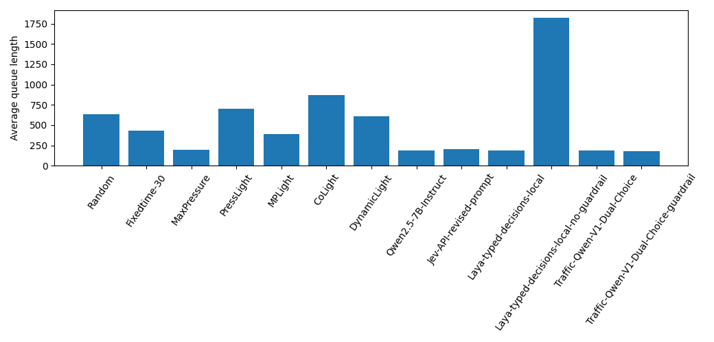
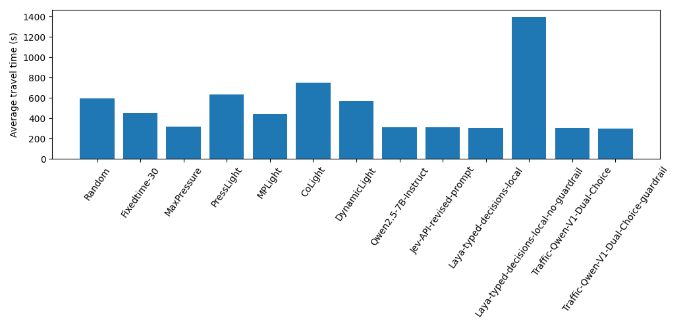
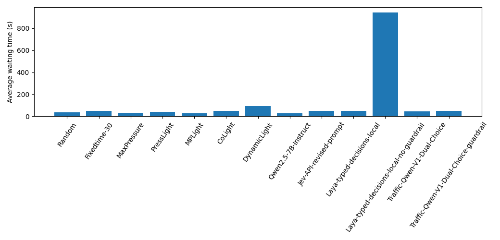

# Traffic-Qwen Decision

Traffic-Qwen Decision is a local, non-generative decision controller for adaptive traffic signals. It adapts JevLight CityFlow control to Qwen3.5-0.8B using a 4-bit QLoRA adapter and Clef decision head. One inference emits two typed choice distributions from the same structured state: four phases and six green durations (15, 20, 25, 30, 35, 40 seconds). The CityFlow runner follows JevLight five-second decision ticks and five-second yellow transitions.

This repository packages the measured Traffic-Qwen V1 Dual-Choice imitation experiment. Its labels imitate actions applied by JevLight with guardrail; they are not optimal or counterfactual labels. It is supervised imitation, not reinforcement learning, zero-shot control, self-evolution, or evidence of deployment readiness.

## Benchmark Scope and JevLight Version

Traffic-Qwen V1 was developed, trained, and evaluated using the legacy CityFlow-based JevLight benchmark protocol. The experiment uses the Jinan 3×4 network, a 3,600-second simulation horizon, and the same average queue length, average waiting time, and average travel time metrics reported in JevLight's preserved `results/benchmark_jinan.json` baseline.

The current JevLight main branch has since migrated its runtime to SUMO and introduced two execution modes: `jevlight`, for local per-intersection decisions, and `cojevlight`, for coordinated network-level decisions. However, the benchmark table currently displayed by JevLight is explicitly identified as having been produced by its CityFlow-based benchmark harness.

Therefore, the Traffic-Qwen V1 results remain directly relevant to the preserved legacy JevLight CityFlow baseline under the same scenario and evaluation protocol. They must not be interpreted as results obtained from the current SUMO-based JevLight or CoJevLight implementation.

In summary:

- Traffic-Qwen V1 is validated against the preserved CityFlow-based JevLight benchmark.
- Its comparisons with Laya, Jev, Qwen2.5-7B, MaxPressure, and the reported RL baselines remain valid within that benchmark scope.
- Traffic-Qwen V1 has not yet been evaluated in the current SUMO implementation.
- Evaluation under SUMO, including both `jevlight` and `cojevlight` modes, is planned as the next experimental stage.

## Measured result

The model trained on 1,065 guarded Jinan decisions from one episode (792 train, 130 validation, 143 chronological held-out test). Training took 637 seconds and peaked at 2.08 GiB VRAM. Offline test accuracy was 79.0% for phase and 97.2% for duration, while duration macro-F1 was 0.489 because labels are highly imbalanced. Temperatures were fit on validation for offline analysis only; the CityFlow controller used the model's uncalibrated distributions.

Jinan 3×4, 3,600 simulated seconds:

| Controller | Average queue | Average waiting (s) | Average travel (s) |
|---|---:|---:|---:|
| Traffic-Qwen, no guardrail | 189.96 | 46.71 | 303.12 |
| Traffic-Qwen, guardrail | 180.71 | 47.08 | 297.60 |
| Laya, guardrail | 191.39 | 47.36 | 303.87 |
| Laya, no guardrail | 1,823.44 | 943.76 | 1,395.36 |
| MaxPressure | 199.68 | 30.76 | 317.51 |
| Qwen2.5-7B-Instruct | 189.14 | 25.34 | 312.47 |

> **Scope note:** All Traffic-Qwen V1 comparisons reported below refer to the preserved CityFlow-based JevLight benchmark. They are not SUMO or CoJevLight results.

### Benchmark metrics

| Average queue | Average travel time | Average waiting time |
|---|---|---|
|  |  |  |

Without guardrail, Traffic-Qwen used all four phases, switched phase 1,262 times, and retained the current phase on 1.94% of decisions. It chose only 20-second (739 times) and 40-second (560 times) durations. The trace-derived maximum non-service proxy was 900 seconds. Phase lock was removed, but residual starvation and duration-collapse remain concerns. With guardrail, 25 corrections and zero fallbacks were recorded. These results cover one seed and one episode; the chronological test segment is not an unseen-episode test.

The tracked results include the report, machine-readable metrics, comparison, offline evaluation, and figures. Full raw and compressed decision traces are retained locally under results/traces/ for audit, but are Git-ignored because redistribution terms for the Jinan-derived observations are unverified. The extended benchmark preserves the original JevLight schema; the original benchmark was not overwritten.

## Quick setup

Use Ubuntu 22.04/24.04 with Python 3.10, an NVIDIA GPU and CUDA-capable driver. The measured machine was WSL2 Ubuntu, Python 3.10.22, RTX 4060 Laptop GPU (8 GiB), driver 581.80, Torch 2.14.1+cu130. See artifacts_manifest/environment.json.

~~~bash
conda env create -f environment.yml
conda activate traffic-qwen
python -m pip install -r requirements-lock.txt
python scripts/install_jevlight_dependency.py
python scripts/check_environment.py
~~~

The setup script checks out JevLight at the exact commit used and applies the recorded runtime patch. Traffic data and trained weights are not included in Git; see data/README.md and checkpoints/README.md.

## Prepare V1 data

The full V1 JSONL splits are excluded because redistribution terms for the underlying Jinan-derived trace could not be confirmed. Obtain an authorized guarded state_action.json, then run:

~~~bash
python scripts/prepare_data.py --trace /path/to/authorized/state_action.json
~~~

This rebuilds the imitation rows and two-choice rows using the recorded chronological split logic. Compare output hashes and counts with data/manifests before training. The script requires an authorized source trace; it does not fabricate replacement data.

## Train and evaluate

~~~bash
bash scripts/reproduce_smoke_test.sh
python scripts/train_traffic_qwen.py --config configs/traffic_qwen_v1_dual_choice.json
python scripts/evaluate_offline.py --config configs/traffic_qwen_v1_dual_choice.json
bash scripts/reproduce_jinan.sh no-guardrail
~~~

Training is explicit and takes several minutes. Jinan reproduction additionally requires authorized Jinan roadnet/traffic files and the local adapter checkpoint. The smoke script performs a 10-step technical check. The main evaluation disables guardrail and fallback; the guarded run is secondary.

~~~bash
python -m unittest discover -s tests -v
python scripts/verify_artifacts.py
~~~

## Checkpoint and licensing

The local checkpoints/traffic-qwen-v1-dual-choice folder contains the adapter and Clef head used in the experiment, but Git ignores its weights. No merged checkpoint exists: the offline merge attempt could not resolve the base model through Hugging Face. The full Qwen base model and all Hugging Face caches are excluded.

Traffic-Qwen code is MIT; see LICENSE and third_party/. The Qwen base model card identifies Apache-2.0. JevLight is MIT and CityFlow is Apache-2.0. Dataset files are not redistributed here.

## Scientific status

The measured result is best described as partial transfer: phase lock was eliminated on the evaluated episode and no-guardrail traffic metrics approached guarded Laya, but duration choice collapsed to two classes and the maximum non-service proxy remained high. See docs/limitations.md, docs/methodology.md, and docs/future_work.md.

## Acknowledgements

This project builds upon JevLight by HKUST(GZ) USAIL,
which provides the traffic-signal-control framework,
baseline controllers, datasets, and evaluation protocol.

The model uses Qwen3.5-0.8B by Qwen, with Unsloth providing the QLoRA training framework and tooling.

JevLight:
https://github.com/usail-hkust/JevLight

CityFlow:
https://github.com/cityflow-project/CityFlow

SUMO (planned next evaluation environment):
https://github.com/eclipse-sumo/sumo

